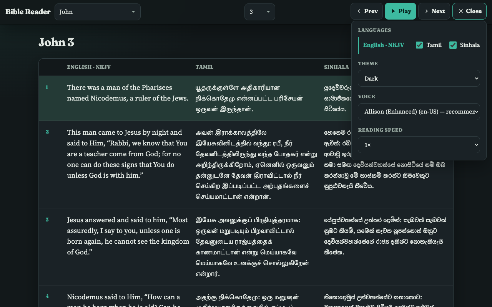
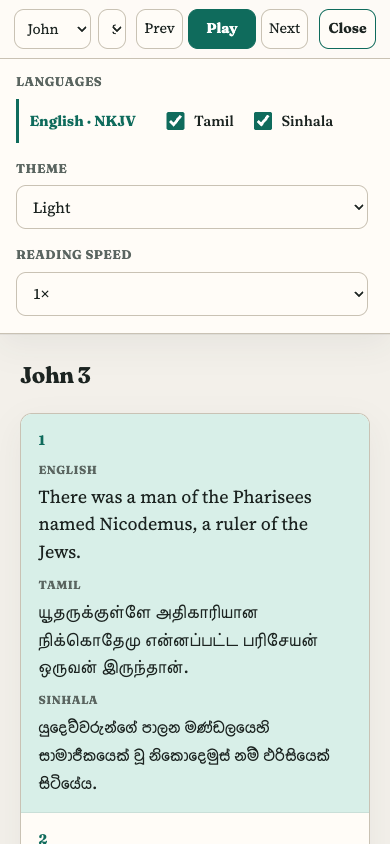

# Bible Search / Bible Reader

Multilingual Bible reader (English NKJV, Tamil, Sinhala) with speech playback. The public app is a static site on GitHub Pages and can be installed on phones as a Progressive Web App.

**Live site:** [https://andrewsheelan.github.io/bible_search/](https://andrewsheelan.github.io/bible_search/)

## Features

- One-line toolbar: book, chapter, Prev / Play / Next, and **Menu**
- Menu controls: Tamil / Sinhala toggles, theme, voice, reading speed
- English always visible; Tamil and Sinhala optional (on by default)
- Book and chapter dropdowns grouped by Old / New Testament
- English text-to-speech with verse highlight, prev/next, speed, and voice picker (prefers higher-quality system voices when available)
- Themes: Light, Dark, High contrast light, High contrast dark
- Desktop: parallel language columns · Mobile: languages stacked per verse
- Preferences saved in `localStorage` (theme, languages, voice, speed, last book/chapter)
- Installable PWA with offline app shell; opened chapters are cached for re-reading offline

## Install on your phone

Requires the live HTTPS site (or `localhost`):

| Platform | How to install |
|----------|----------------|
| **Android (Chrome)** | Open the site → browser menu → **Install app** or **Add to Home screen** |
| **iPhone (Safari)** | Open the site → Share → **Add to Home Screen** |

After the first visit, the app shell works offline. Verse text for chapters you have already opened is available offline as well.

## Screenshots

### Light


### Dark


### Dark with menu open



### High contrast light


### High contrast dark


### Mobile


### Mobile with menu open



## Try locally

Serve the `docs/` folder over HTTP (needed for the service worker and speech APIs):

```bash
cd docs
python3 -m http.server 8080
```

Open [http://localhost:8080/](http://localhost:8080/).

## Deploy to GitHub Pages

1. Push `docs/` to `master` (or your default branch).
2. Repo **Settings → Pages → Build and deployment**
   - Source: **Deploy from a branch**
   - Branch: `master` → `/docs`
3. Site URL: `https://andrewsheelan.github.io/bible_search/`

## Project layout

| Path | Purpose |
|------|---------|
| `docs/` | GitHub Pages app (UI + verse JSON) |
| `docs/index.html` | App shell |
| `docs/css/style.css` | Themes and responsive layout |
| `docs/js/app.js` | Navigation, rendering, preferences, PWA registration |
| `docs/js/reader.js` | English speech reader |
| `docs/json/` | Verse data (`*_en_nkjv`, `*_ta_tav`, `*_sn_snv`) |
| `docs/manifest.webmanifest` | PWA manifest |
| `docs/sw.js` | Service worker (shell + chapter cache) |
| `docs/icons/` | App icons |
| `docs/screenshots/` | README screenshots |
| `vendor/bible/` | Legacy static copy (not used by the live UI) |
| Rails / Docker files | Original Rails app; optional, not required for Pages |

## Rails app (optional)

This repository also includes a Rails + Docker setup for admin/search workflows. See `docker-compose.yml` if you need that path. The public Bible Reader on GitHub Pages does not depend on Rails.
