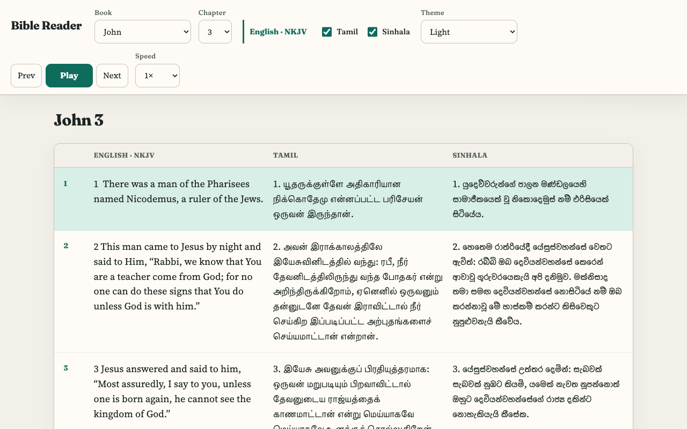
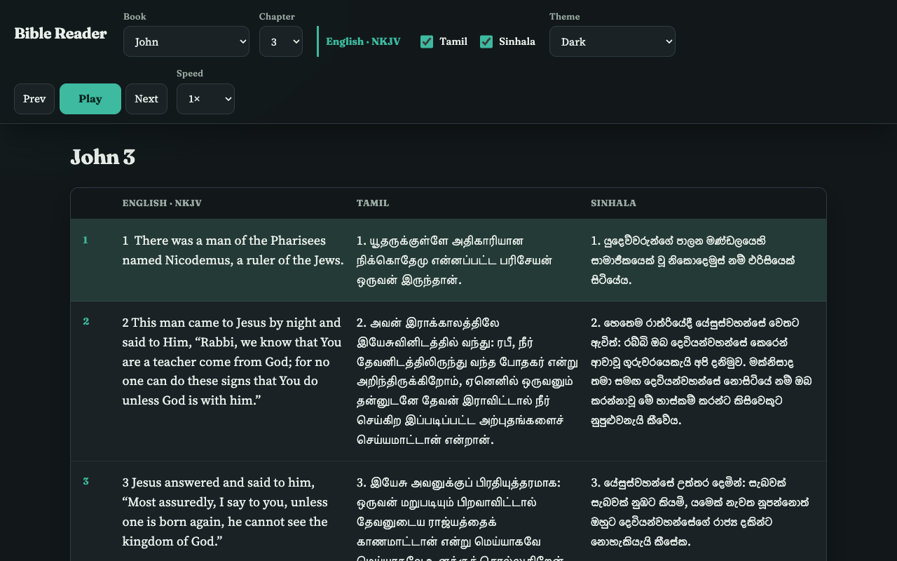
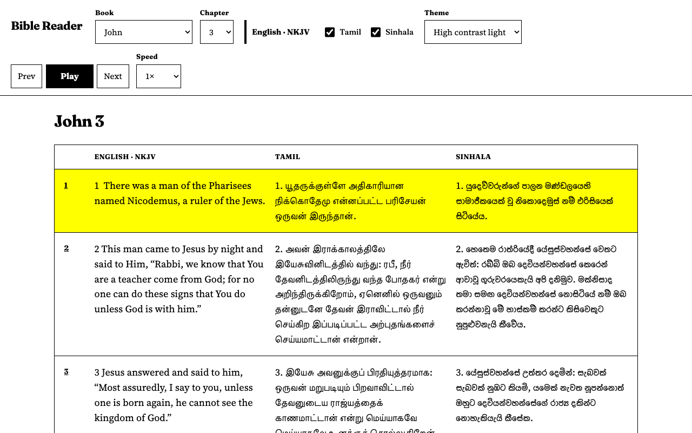
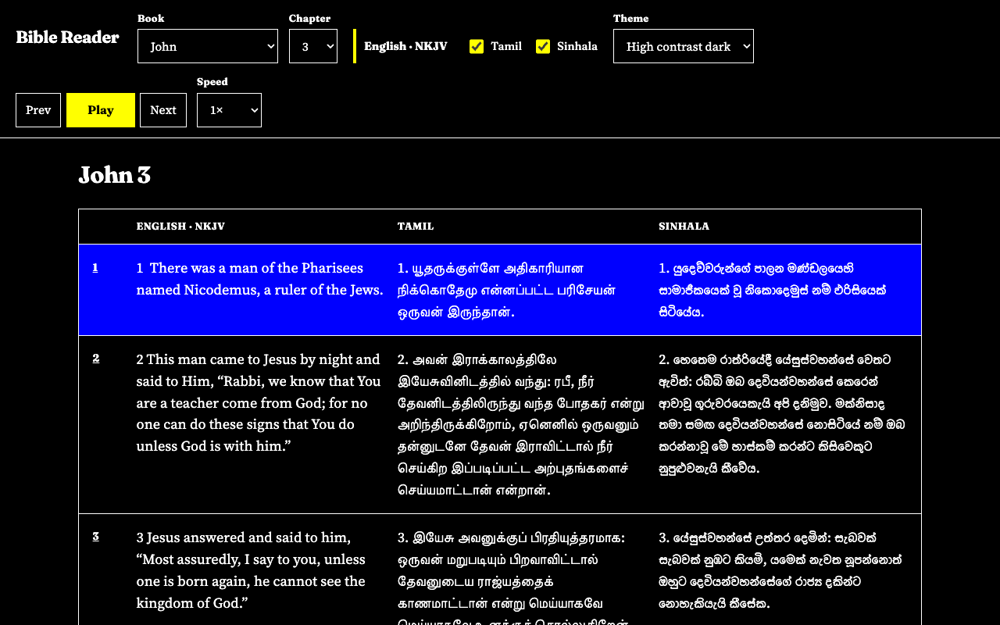
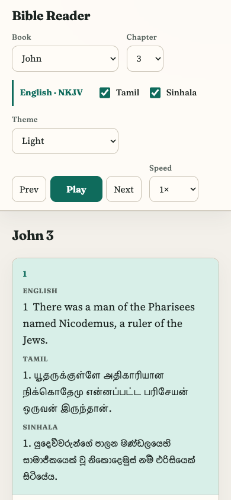

# Bible Search / Bible Reader

Multilingual Bible reader (English NKJV, Tamil, Sinhala) with a modern static UI on GitHub Pages.

**Live site:** [https://andrewsheelan.github.io/bible_search/](https://andrewsheelan.github.io/bible_search/)

## Features

- Book and chapter dropdowns (Old / New Testament groups)
- Side-by-side English, Tamil, and Sinhala (English always on; Tamil/Sinhala optional)
- English text-to-speech: play / pause, previous / next verse, speed control
- Themes: Light, Dark, High contrast light, High contrast dark
- Mobile-friendly stacked verse layout
- Preferences saved in `localStorage`

## Screenshots

### Light



### Dark



### High contrast light



### High contrast dark



### Mobile



To replace or add screenshots, drop PNGs into `docs/screenshots/` and link them above.

## Try locally

```bash
cd docs
python3 -m http.server 8080
```

Open [http://localhost:8080/](http://localhost:8080/).

## Project layout

| Path | Purpose |
|------|---------|
| `docs/` | GitHub Pages site (HTML, CSS, JS, JSON verses) |
| `docs/screenshots/` | README screenshots |
| `vendor/bible/` | Legacy static copy (not maintained for the live UI) |
| Rails / Docker files | Original Rails app; optional, not required for Pages |

## GitHub Pages

Deploy from branch `master` with folder `/docs` (Settings → Pages).

## Rails app (optional)

The repository also contains a Rails + Docker setup for admin/search workflows. See `docker-compose.yml` if you need that path; the public reader above does not depend on it.
